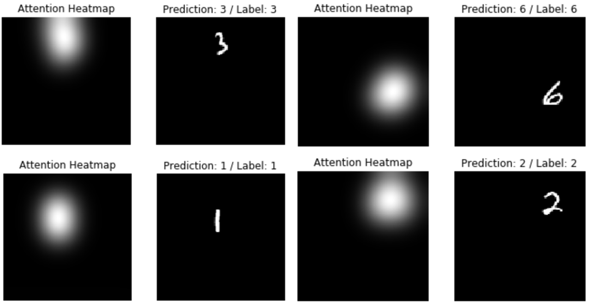
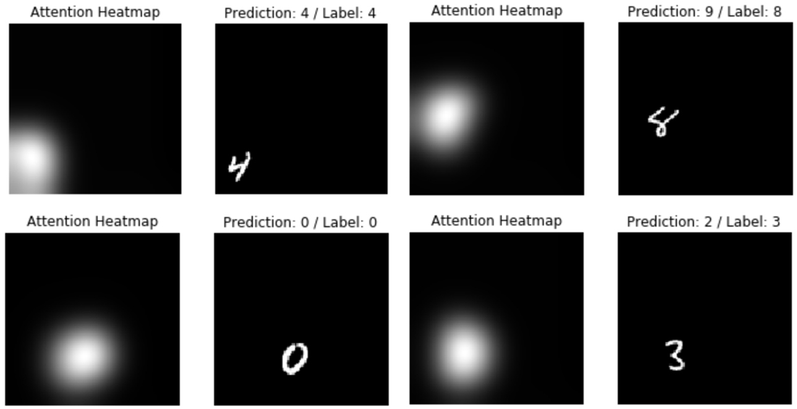

# Attention

## Introduction
This repository is for algorithms of `Attention`.

The paper I implemented is as follows. 

- [Show, Attend and Tell: Neural Image Caption Generation with Visual Attention](https://arxiv.org/abs/1502.03044)


### Dataset

This Algorithm will be tested by `Modified MNIST dataset` Which is made by [Jongwon Park](https://github.com/jwpark116). 

This modified MNIST dataset is good for verifying attention algorithm.

The example of modified MNIST is as follows. 


You can download this modified MNIST data from this link

[Training dataset](https://www.dropbox.com/s/e7jxyulxx2anqyq/MNIST_data_train_re.mat?dl=0)  /  [Testing dataset](https://www.dropbox.com/s/fcw4754bavva9my/MNIST_data_test_re.mat?dl=0)


### Environment
**Software**
* Windows7 (64bit)
* Python 3.5.2
* Anaconda 4.2.0
* Tensorflow-gpu 1.4.0

**Hardware**
* CPU: Intel(R) Core(TM) i7-4790K CPU @ 4.00GHZ
* GPU: GeForce GTX 1080
* Memory: 8GB


## Algorithms

### Soft Attention

 This algorithm is from the paper [Show, Attend and Tell: Neural Image Caption Generation with Visual Attention](https://arxiv.org/abs/1502.03044). I studied attention from [Heuritech blog](https://blog.heuritech.com/2016/01/20/attention-mechanism/). 

  The attention model for image captioning from paper is as follows. The image is from the [Heuritech blog](https://blog.heuritech.com/2016/01/20/attention-mechanism/). 


For implementing this algorithm, `Attention model` and `LSTM` are needed. The code of LSTM is as follows. 

```python
# LSTM function
def LSTM_cell(C_prev, h_prev, x_lstm, Wf, Wi, Wc, Wo, bf, bi, bc, bo):
    # C_prev: Cell state from lstm of previous time step (shape: [batch_size, lstm_size])
    # h_prev: output from lstm of previous time step (shape: [batch_size, lstm_size])
    # x_lstm: input of lstm (shape: [batch_size, data_flatten_size])

    input_concat = tf.concat([x_lstm, h_prev], 1)
    f = tf.sigmoid(tf.matmul(input_concat, Wf) + bf)
    i = tf.sigmoid(tf.matmul(input_concat, Wi) + bi)
    c = tf.tanh(tf.matmul(input_concat, Wc) + bc)
    o = tf.sigmoid(tf.matmul(input_concat, Wo) + bo)
    
    C_t = tf.multiply(f, C_prev) + tf.multiply(i, c) 
    h_t = tf.multiply(o, tf.tanh(C_t))
    
    return C_t, h_t # Cell state, Output
```

 [Colah's blog post](http://colah.github.io/posts/2015-08-Understanding-LSTMs/) is very good for understanding LSTM and I studied this post to implement LSTM. 

 Structure image of soft attention model is as follows. Image is from [Heuritech blog](https://blog.heuritech.com/2016/01/20/attention-mechanism/). 


 Also, the code of soft attention is as follows. 

```python
# Soft Attention function
def soft_attention(h_prev, a, Wa, Wh):
    # h_prev: output from lstm of previous time step (shape: [batch_size, lstm_size])
    # a: Result of CNN [batch_size, conv_size * conv_size, channel_size] 

    m_list = [tf.tanh(tf.matmul(a[i], Wa) + tf.matmul(h_prev, Wh)) for i in range(len(a))] 
    m_concat = tf.concat([m_list[i] for i in range(len(a))], axis = 1)     
    alpha = tf.nn.softmax(m_concat) 
    z_list = [tf.multiply(a[i], tf.slice(alpha, (0, i), (-1, 1))) for i in range(len(a))]
    z_stack = tf.stack(z_list, axis = 2)
    z = tf.reduce_sum(z_stack, axis = 2)

    return alpha, z
```

After 10 epoch, The training accuracy of LSTM was 94% and validation accuracy was 97%.

Sample images of soft attention result are as follows. 




### Hard Attention

 This algorithm is from the paper [Show, Attend and Tell: Neural Image Caption Generation with Visual Attention](https://arxiv.org/abs/1502.03044). Hard Attention architecture image from [Heuritech blog](https://blog.heuritech.com/2016/01/20/attention-mechanism/) is as follows. 


 The random choice algorithm is `Monte-Carlo Sampling`. Therefore, I made a code for hard attention as follows. 

```python
# Hard Attention function
def hard_attention(h_prev, a, Wa, Wh):
    # h_prev: output from lstm of previous time step (shape: [batch_size, lstm_size])
    # a: Result of CNN [batch_size, conv_size * conv_size, channel_size] 

    m_list = [tf.tanh(tf.matmul(a[i], Wa) + tf.matmul(h_prev, Wh)) for i in range(len(a))] 
    m_concat = tf.concat([m_list[i] for i in range(len(a))], axis = 1)     
    alpha = tf.nn.softmax(m_concat) 
    
    #For Monte-Carlo Sampling
    alpha_cumsum = tf.cumsum(alpha, axis = 1)
    len_batch = tf.shape(alpha_cumsum)[0]
    rand_prob = tf.random_uniform(shape = [len_batch, 1], minval = 0., maxval = 1.)
    alpha_relu = tf.nn.relu(rand_prob - alpha_cumsum)
    alpha_index = tf.count_nonzero(alpha_relu, 1)
    alpha_hard  = tf.one_hot(alpha_index, len(a))

    z_list = [tf.multiply(a[i], tf.slice(alpha_hard, (0, i), (-1, 1))) for i in range(len(a))]
    z_stack = tf.stack(z_list, axis = 2)
    z = tf.reduce_sum(z_stack, axis = 2)

    return alpha, z
```


After 10 epoch, The training accuracy of LSTM was only 30% and validation accuracy was 33%.

Sample images of hard attention result are as follows. 




